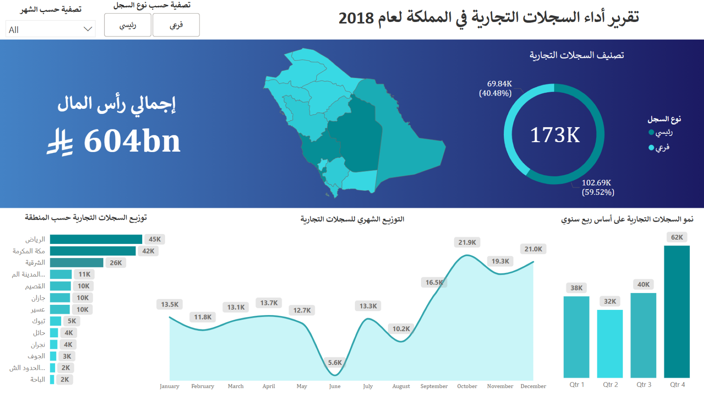

# 🏢 Business Registry Performance Analysis KSA 2018

## 🎯 **Project Overview**

> **🏆 Best Dashboard Competition - MASAR Team**  
> Economic intelligence dashboard analyzing 173K business registrations across Saudi Arabia

---

## 📈 **Key Performance Indicators**

### 💰 **Financial Metrics**
- **💎 Total Capital:** 604 Billion SAR
- **🏭 Business Volume:** 173,000 registrations nationwide
- **📊 Economic Impact:** Comprehensive capital analysis across 13 regions

### 🏢 **Registration Analytics**
- **🔸 Primary Registrations:** 102.69K (59.52%)
- **🔹 Branch Registrations:** 69.84K (40.48%)
- **📍 Geographic Coverage:** All 13 Saudi regions analyzed

### 🗺️ **Regional Distribution**
- **🏙️ Riyadh:** 45K registrations (Leading region)
- **🕋 Makkah:** 42K registrations  
- **⚡ Eastern Province:** 26K registrations
- **🌸 Medina:** 11K | 🌾 Qassim: 10K | 🌊 Jazan: 10K
- **🏔️ Asir:** 10K | 🏜️ Tabuk: 5K | 🌺 Hail: 4K

### 📅 **Seasonal Performance**
- **📈 Peak Month:** October (21.9K registrations)
- **📉 Lowest Month:** June (5.6K registrations)
- **🚀 Strongest Quarter:** Q4 (62K registrations)
- **📊 Growth Pattern:** 63% Q4 increase vs Q1

---

## 🛠️ **Technical Implementation**

### 📊 **Tools & Technologies Used:**
- **🗺️ Microsoft Power BI** - Geographic mapping & advanced analytics
- **📈 Microsoft Excel** - Statistical analysis & data processing
- **⚡ DAX Calculations** - Time intelligence & performance metrics
- **🔄 Power Query** - Government data integration & ETL

### 🎨 **Dashboard Features:**
- **🗺️ Interactive Choropleth Maps** - Regional distribution visualization
- **📈 Time Series Analysis** - Monthly & quarterly trend tracking
- **📊 Comparative Analytics** - Registration type breakdowns
- **🎛️ Advanced Filtering** - Multi-dimensional data exploration

### 📋 **Data Visualization Components:**
- 🗺️ Geographic heat maps for regional analysis
- 📈 Area charts for seasonal trends
- 🍩 Donut charts for registration types
- 📊 Bar charts for quarterly comparisons

---

## 💼 **Business Impact & Value**

### 🎯 **Strategic Insights:**
- **🏛️ Government Planning** - Regional economic development strategies
- **💼 Business Intelligence** - Market opportunity identification
- **💰 Investment Guidance** - Data-driven investment decisions
- **📊 Economic Research** - Business formation trend analysis

### 📚 **Key Findings:**
- **🎯 Regional Concentration** - Riyadh & Makkah: 50.3% of registrations
- **📅 Seasonal Patterns** - Q4 peak business formation activity
- **📈 Growth Momentum** - Consistent upward registration trends
- **⚖️ Balanced Distribution** - Healthy mix of primary vs branch registrations

---

## 🏆 **Project Achievements**

### ✅ **Competition Success:**
- 📊 Advanced Power BI visualization techniques
- 🗺️ Interactive geographic mapping excellence
- 📈 Professional business intelligence presentation

### 🚀 **Technical Excellence:**
- ⚡ Complex DAX calculations for economic metrics
- 🔄 Automated data refresh from government sources
- 🎨 Professional dashboard design with intuitive UX
- 📊 Multi-dimensional filtering and drill-down capabilities

---

## 📋 **Project Details**

**🏆 Competition:** Best Dashboard Competition - MASAR  
**🏢 Domain:** Economic Intelligence & Business Analytics  
**🛠️ Tools:** Power BI, Excel, DAX, Power Query  
**📊 Data Source:** Ministry of Commerce - Saudi Arabia  

---

> **🚀 This project demonstrates advanced economic analytics capabilities and strategic geographic intelligence essential for government policy development and business market analysis.**
